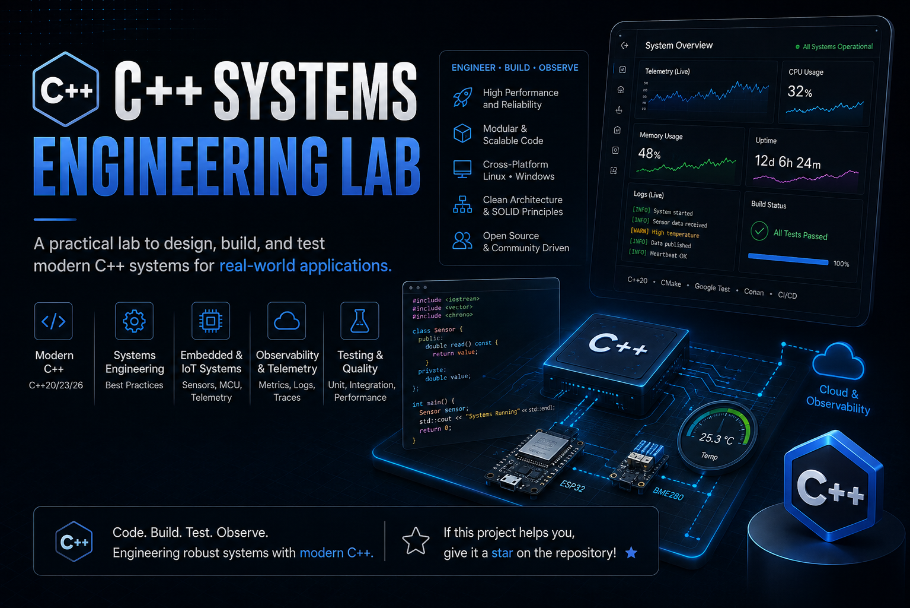

# C/C++ Systems Engineering Lab

Hands-on systems engineering with modern C and C++, embedded telemetry, environmental sensing, telecommunications infrastructure monitoring, and observability.

This repository is a progressive engineering laboratory rather than a collection of isolated syntax exercises. Each lab addresses a realistic operational scenario and produces a small, testable, and documented deliverable.

The initial path connects electronics and firmware to native software and SRE practices:

```text
sensors
    ↓
embedded firmware
    ↓
telemetry protocol
    ↓
C++ monitoring service
    ↓
metrics, dashboards, alerts, and incident analysis
```

> [!IMPORTANT]
> The systems in this repository are educational bench prototypes. They are not certified or approved for deployment in operational telecommunications, aviation, marine, safety-critical, RF transmission, or high-voltage environments.

## Current objectives

* Practice modern and defensive C and C++ through useful systems scenarios.
* Integrate sensors, microcontrollers, native applications, and telemetry.
* Build deterministic and testable software with explicit failure behavior.
* Apply observability and SRE practices to a C++ service.
* Document requirements, architecture, verification, and incident findings.
* Build a portfolio relevant to embedded systems, telemetry, infrastructure, and systems engineering roles.

## Initial learning path

| Lab | Project                                                                                     | Primary focus                                             | Target duration | Status  |
| --- | ------------------------------------------------------------------------------------------- | --------------------------------------------------------- | --------------: | ------- |
| 00  | [Modern C/C++ Engineering Baseline](labs/00-modern-c-cpp-engineering-baseline/)             | Toolchain, builds, tests, and diagnostics                 |       1–2 weeks | Planned |
| 01  | [Compact Environmental Telemetry Station](labs/01-compact-environmental-telemetry-station/) | Sensors, PIC firmware, protocol, and host receiver        |       3–5 weeks | Planned |
| 02  | [Telecom Site Infrastructure Monitor](labs/02-telecom-site-infrastructure-monitor/)         | C++ domain model, operational states, and fault scenarios |       3–5 weeks | Planned |
| 03  | [Telecom Observability and Incident Lab](labs/03-telecom-observability-incident-lab/)       | Prometheus, Grafana, alerting, and incident analysis      |       3–4 weeks | Planned |

Only one lab should be active at a time.

A lab is considered complete when its required acceptance criteria are satisfied. Optional extensions do not block completion.

## Engineering approach

### Language baseline

* **C17** for portable firmware and hardware-facing components when supported by the selected toolchain.
* **C++20** for Linux and desktop applications.
* **C++17-compatible architecture** when embedded portability is a requirement.
* Newer standards are adopted only when they provide a clear benefit and are supported by the selected compiler and target.

Modern C++ does not mean using every recent language feature. In this repository, it means:

* clear ownership;
* RAII;
* value semantics;
* strong types;
* small interfaces;
* controlled resource usage;
* explicit error handling;
* deterministic behavior;
* automated testing.

### Dual review policy

Every material change to the roadmap, architecture, language baseline, dependency set, or hardware platform must pass two reviews:

1. **C/C++ engineering review**
   Language support, safety, portability, deterministic behavior, diagnostics, testing, and maintainability.

2. **Industry relevance review**
   Current relevance to embedded, telecommunications, infrastructure, aerospace, aviation, and marine employers, especially in Florida.

The complete checklist is maintained in [Engineering Standards](docs/engineering-standards.md).

## Initial scope boundaries

The initial phase intentionally excludes:

* implementation of a 5G Radio Access Network;
* implementation of a cellular core;
* transmission on licensed RF spectrum;
* access to carrier-owned equipment or subscriber traffic;
* direct work with tower power systems or high-voltage batteries;
* Kubernetes and large distributed architectures;
* production cloud deployment;
* machine learning and predictive maintenance;
* certified avionics or marine software claims;
* a complete professional meteorological station.

The telecommunications scenario covers the operational infrastructure surrounding a remote site:

* environmental conditions;
* low-voltage bench power;
* cabinet access;
* cooling;
* vibration or tilt;
* telemetry health;
* alarms;
* availability.

## Repository structure

```text
cpp-systems-engineering-lab/
├── README.md
├── ROADMAP.md
├── LICENSE
├── .gitignore
│
├── docs/
│   ├── engineering-standards.md
│   └── images/
│       └── CPP_Systems_Overview_13_24_47.png
│
└── labs/
    ├── 00-modern-c-cpp-engineering-baseline/
    ├── 01-compact-environmental-telemetry-station/
    ├── 02-telecom-site-infrastructure-monitor/
    └── 03-telecom-observability-incident-lab/
```

Source code, tests, data, configuration, and architecture directories will be added inside each lab only when implementation begins.

This avoids empty placeholder structures and allows each lab to document its real implementation.

## Hardware strategy

The first embedded target will be selected after the available PIC devices, boards, sensors, and programmers are inventoried.

Initial selection priority:

1. PIC32, when current tool and board support are available;
2. dsPIC33 for real-time control and signal-oriented applications;
3. recent PIC18 devices for a compact sensor node;
4. PIC16 when sufficiently current and supported.

STM32 and other ARM platforms remain future complementary targets rather than replacements for PIC.

The telemetry protocol and most domain logic should remain independent from a specific microcontroller.

## Future specialization tracks

These tracks are intentionally deferred until the initial four labs are complete:

* ARM and STM32 embedded monitoring node;
* RTOS and Zephyr;
* multi-site telecommunications monitoring;
* CAN, Modbus, SNMP, or cellular modem integration;
* aviation and aerospace telemetry;
* marine telemetry and onboard monitoring.

See [ROADMAP.md](ROADMAP.md) for sequencing and completion gates.

## License

This project is licensed under the [MIT License](LICENSE).

---

## 📈 Repository Metrics

<p align="center">

<a href="https://info.flagcounter.com/YhT2"></a>

</p>
